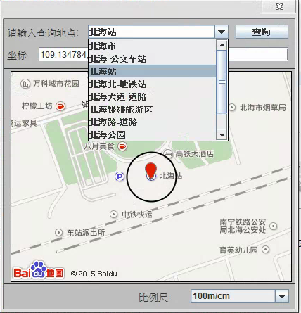

# FindLocation
用Java实现通过调用百度地图API，实现查找地点经纬度和范围的功能。


# 注意
百度地图[地点搜索](http://api.map.baidu.com/place/v2/suggestion?ak=3OwsREAN0XK5707kEbbniePY&region=%E5%85%A8%E5%9B%BD&query=beihai&output=json)接口需要认证，且有访问限制：每天只能访问50万次。

请替换ak为自己申请的ak：
```
public class PlaceSuggession {
	// 申请的密钥，注：这个密钥一天只能访问50万次，而且需要申请
	public static final String AK = "3OwsREAN0XK5707kEbbniePY";
```
# 用法
```
GeofencingDialog dialog = new GeofencingDialog();   
dialog.setVisible(true); //显示对话框   
String radius = dialog.getRadiusStr(); //获取半径   
String location = dialog.getLocationStr(); //获取经纬度   
```


## Credits

  - [heqiao2010](https://github.com/heqiao2010)

